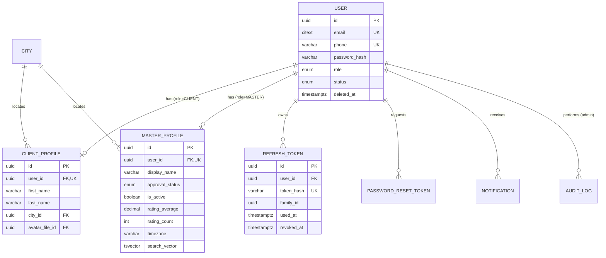
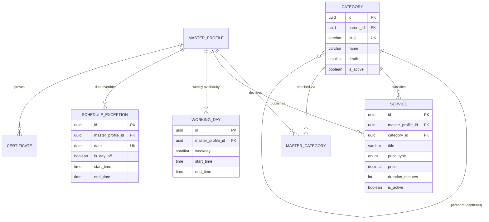
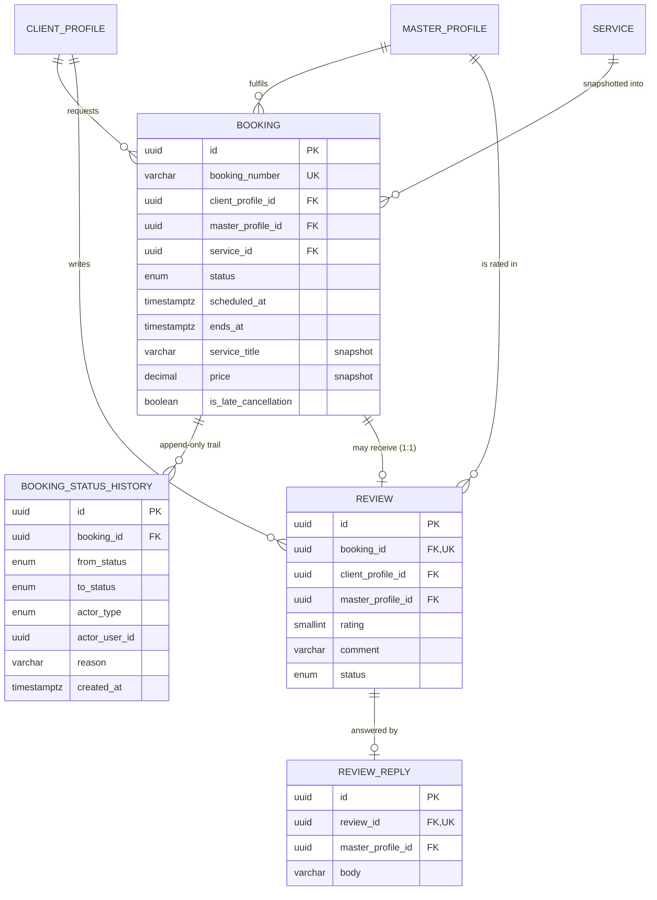
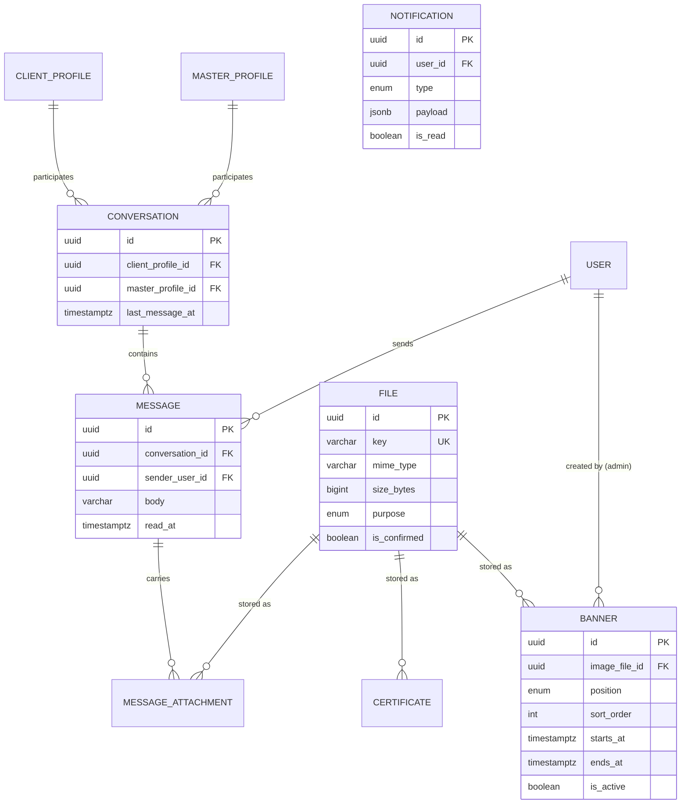
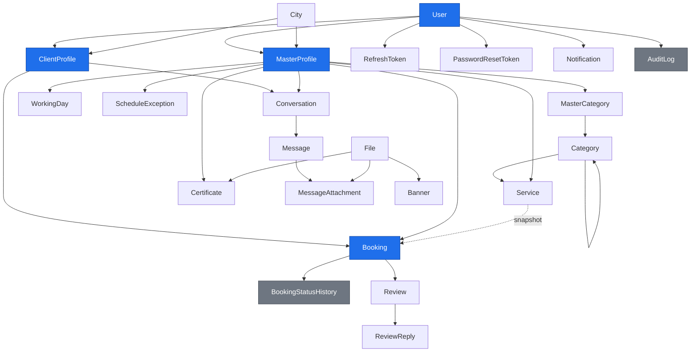

# Entity Relationship Diagram — UstoGo

**Version:** 1.0.0
**Last updated:** 2026-07-29
**Companion document:** `DATABASE.md` (field-level specification)

Diagrams below are Mermaid. Field lists are abbreviated to keys and discriminators; the full column specification lives in `DATABASE.md`.

---

## 1. Identity & Sessions

---

## 2. Catalogue & Availability

---

## 3. Booking Core

**Critical constraints visible here**
- `REVIEW.booking_id` is **unique** → one review per booking (BR-51)
- `REVIEW_REPLY.review_id` is **unique** → one reply per review (BR-57)
- `BOOKING_STATUS_HISTORY` has no update or delete path → immutable audit of the lifecycle (BR-46)
- `BOOKING` carries a price/title snapshot → editing or deleting a `SERVICE` never rewrites history

---

## 4. Messaging, Notifications, Content

`CONVERSATION` has a unique `(client_profile_id, master_profile_id)` pair, so a client and a master can never accumulate duplicate threads (BR-60).

---

## 5. Full Model Overview

---

## 6. Cardinality Reference

| Relationship | Cardinality | Delete behaviour |
| --- | --- | --- |
| User → ClientProfile | 1 : 0..1 | Cascade |
| User → MasterProfile | 1 : 0..1 | Cascade |
| User → RefreshToken | 1 : 0..* | Cascade |
| MasterProfile ↔ Category | * : * (via MasterCategory) | Cascade on the join row |
| MasterProfile → Service | 1 : 0..* | Cascade (soft delete in practice) |
| Category → Service | 1 : 0..* | **Restrict** |
| Category → Category | 1 : 0..* | **Restrict** |
| MasterProfile → WorkingDay | 1 : 0..* | Cascade |
| MasterProfile → ScheduleException | 1 : 0..* | Cascade |
| ClientProfile → Booking | 1 : 0..* | **Restrict** |
| MasterProfile → Booking | 1 : 0..* | **Restrict** |
| Service → Booking | 1 : 0..* | **Restrict** (snapshot protects history) |
| Booking → BookingStatusHistory | 1 : 1..* | Cascade |
| Booking → Review | 1 : 0..1 | **Restrict** |
| Review → ReviewReply | 1 : 0..1 | Cascade |
| Conversation → Message | 1 : 0..* | Cascade |
| Message → MessageAttachment | 1 : 0..* | Cascade |
| File → any owner | 1 : 0..* | **Restrict** |

`Restrict` is the default because business entities are soft-deleted; a hard delete that would orphan history is a programming error and should fail loudly.
